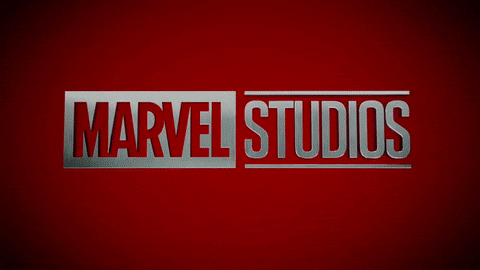
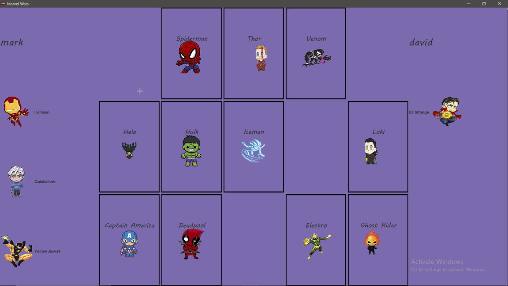
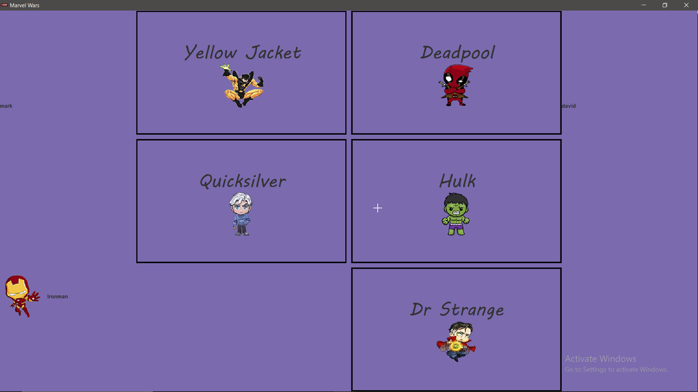
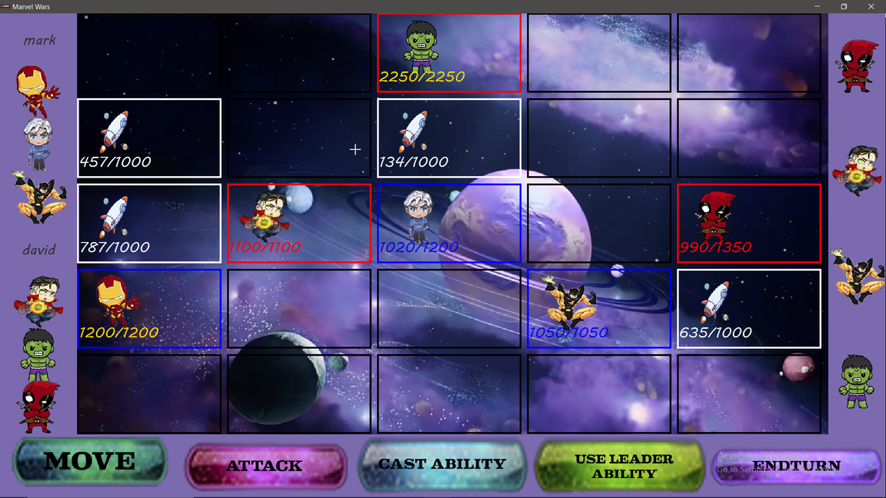

<html>
<h1>Marvel Wars</h1>
     
    
     
    <h2>
    Table of contents
    </h2>
    <h3> 
        <ul>
            <li>Project Title</li>
            <li>Table of contents</li>
            <li>Description</li>
            <li>Usage</li>
            <li>Preview</li>
        </ul>
    </h3>
     
    <h2>Description</h2>
    <h3>This game is a player vs player game, First, each player gets to choose 3 unique Champions from various characters each having its special ability, then each player chooses the leader of the team to start the game. The goal of the game is to eliminate the opponent's whole team to win the game. There are many Champions each having unique special abilities so u can enjoy the game you and your friends each time uniquely.</h3>
    <h3>Happy Gaming !!!!<h3>
     
    <h2>Usage</h2>
    <h3>Open you favorite ide -> Navigate to src -> then views -> then run frame1 and enjoy.</h3>
     
    <h2>Preview</h2>
     
    <h3>Choosing Champions</h3>
     
    
     
    <h3>Choosing Leaders</h3>
     
    
     
    <h3>Gameplay</h3>
     
    
</html>
